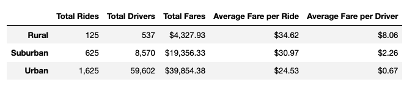
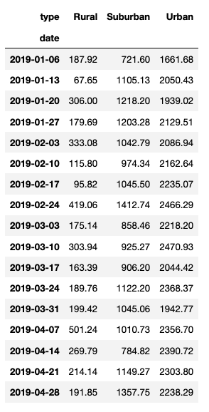
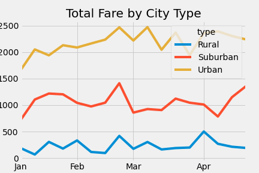

# Pyber Analysis
Traffic Analysis

## Overview of the project
The purpose of this project is to create a summary of ride-sharing data for Urban, Suburban and Rural city types.
We intend to show the trends of weekly fares for each city type and how the data differs for each. Finally, we intend
to analyze the differences and see how they can be used by decision-makers at Pyber. 

## Results
The Ride sharing data summary shows that the Urban city type has the most Total Rides, the most Total Drivers and 
the most total in Fares. But, in contrast, it has the lowest Average Fare per Ride and the lowest Average Fare per Driver.

Rural city type has the lowest totals in Rides, Drivers and Fares. But, has the highest Averages for Fare per Ride and Fare
per Driver.

Break down of Fares by city type shows that all types are fairly steady within the months of January through April.
With Urban totals being the largest amounts and Rural totals being the least amounts.

## Summary
In summary, there are some business recommendations for each City type that can address some of the disparities.
1. Although Urban city types bring in the most revenue of Total Fares, it is the least profitable in terms of Average Fare per Ride and Driver
   A. We recommend increasing fare prices per Ride
   B. Or reduce the number of Drivers in Urban city types
2. Suburban city types do fairly well. But it seems that there are roughly 15 times the number of drivers for only ~6 times the number of rides
than the Rural city types.
   A. We could possibly bring up Average fares for Rides and Drivers by decreasing the number of drivers in Suburban cities.
   
3. Rural cities has the least revenue of Total fares but has the highest average fares per ride and drivers.
	A. Possibly bring up total fares by increasing the number of drivers in the area and providing more rides.  